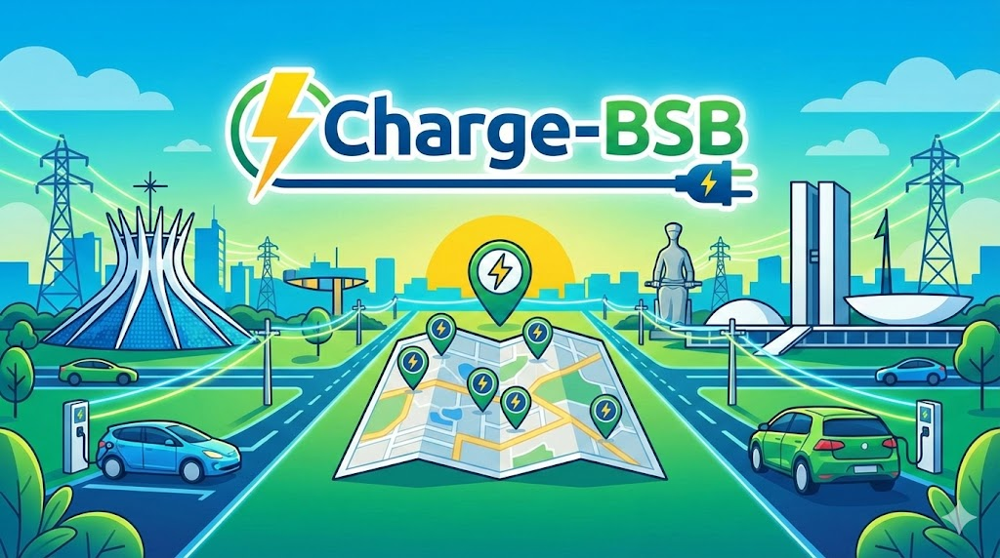
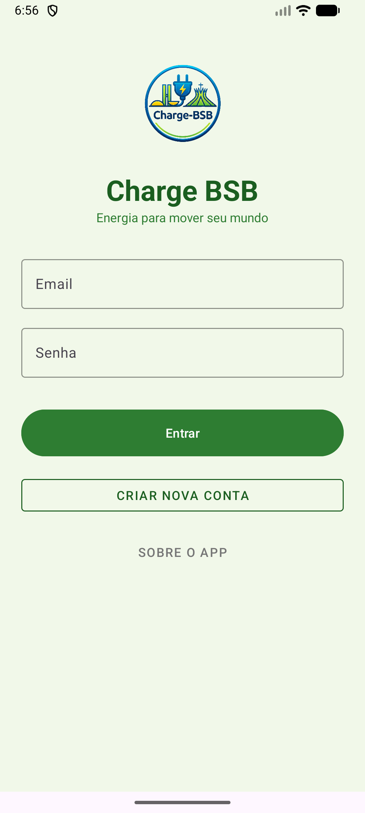
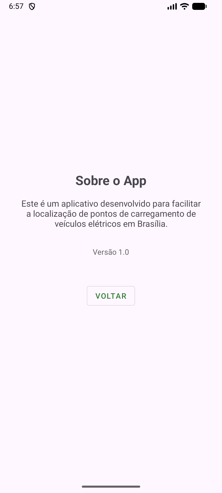
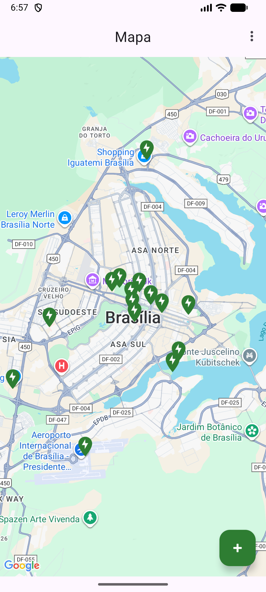
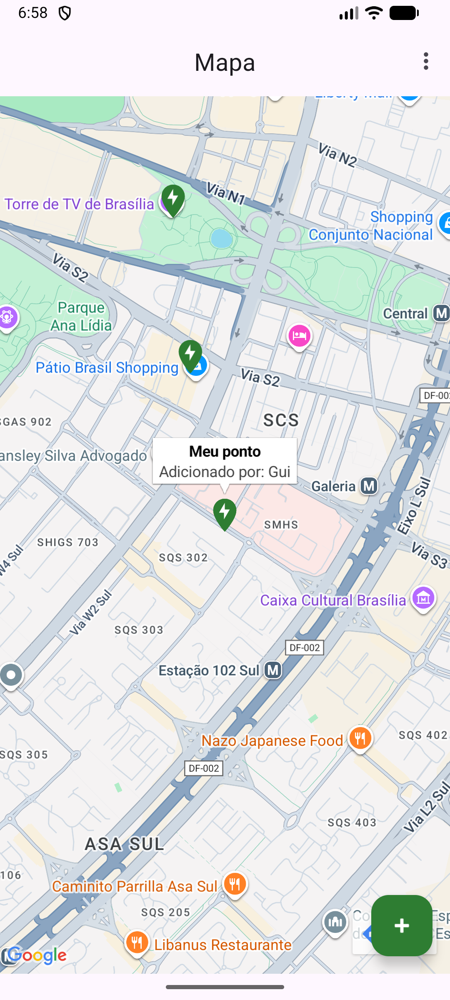
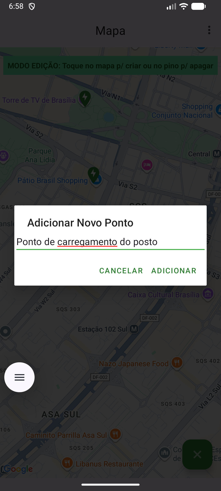
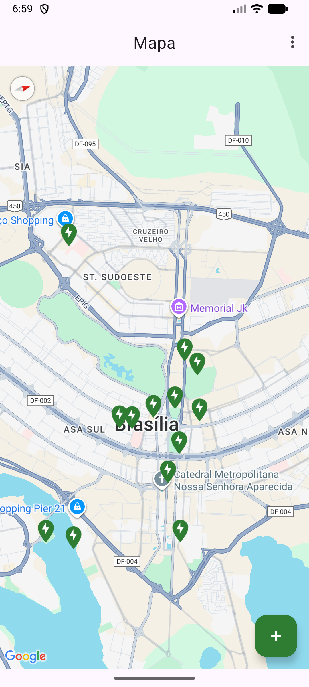

# Charge BSB
Aplicativo Mobile de localização de pontos de carregamento em Brasília-DF.
Localizador de Pontos de Carregamento em Brasília

  
Figura X: Logo da Charge BSB

  
  
Fonte: Os autores (2025)

## 1. Descrição do Problema

Com o crescente aumento da frota de veículos elétricos em Brasília-DF, surge um desafio para os motoristas: a dificuldade em localizar pontos de carregamento disponíveis, funcionais e compatíveis. A falta de uma plataforma centralizada e colaborativa gera incerteza, perda de tempo e dificulta a adesão a essa tecnologia de transporte mais sustentável.

## 2. Justificativa

Este projeto se justifica pela necessidade de apoiar a infraestrutura para mobilidade elétrica na capital federal, contribuindo diretamente para as metas dos Objetivos de Desenvolvimento Sustentável (ODS) da ONU. Ao facilitar o acesso a pontos de carregamento, o aplicativo promove:
* **ODS 7 (Energia Acessível e Limpa):** Incentiva o uso de energia limpa no setor de transportes.
* **ODS 11 (Cidades e Comunidades Sustentáveis):** Contribui para a criação de um sistema de transporte mais sustentável e para a redução da poluição do ar em centros urbanos.

A solução proposta une conhecimento técnico de desenvolvimento mobile com um impacto social e ambiental positivo, alinhado às diretrizes da disciplina.

## 3. Público-Alvo

O aplicativo foi desenvolvido para:
* Motoristas de veículos elétricos que residem ou transitam por Brasília-DF.
* Turistas com veículos elétricos que visitam a cidade.
* Empresas e estabelecimentos que desejam divulgar seus pontos de carregamento.

## 4. Objetivos do App

**Geral:** Desenvolver um aplicativo móvel funcional que permita a localização e consulta de informações sobre pontos de carregamento de veículos elétricos em Brasília-DF.
* **Específicos:**
    * Mapear e exibir os pontos de carregamento em um mapa interativo.
    * Permitir que usuários e administradores cadastrem novos pontos.
    * Detalhar informações de cada ponto: endereço, tipo de conector, preço, status (disponível/ocupado) e fotos.
    * Implementar um sistema de avaliação e comentários para os pontos.

## 5. Tipo de Aplicação

* **Aplicativo Nativo Android** para garantir a melhor performance e integração com os recursos do sistema operacional.

## 6. Tecnologias Utilizadas

* **Linguagem:** Kotlin
* **Banco de dados:** SQLite
* **APIs:** Google Maps API
* **IDE:** Android Studio

## 7. Instruções de Instalação e Uso

**Pré-requisitos:**
* Android Studio instalado.
* Emulador Android (API 28 ou superior) ou um dispositivo físico.

**Passo a passo:**
1.  Clone o repositório: `git clone https://github.com/GCVS2k/CHARGE-BSB.git`
2.  Abra o projeto no Android Studio.
3.  O Android Studio irá sincronizar e baixar as dependências (Gradle Sync).
4.  Execute o aplicativo clicando no botão 'Run'.

## 8. Requisitos do Sistema

* **Sistema Operacional:** Android 9.0 (Pie) ou superior.

## 9. Evidências Visuais (Screenshots)

|  |  |  |   |                      |
|:---------------------------------------------:|:---------------------------------------------:|:---------------------------------------------:|:----------------------------------------------:|:----------------------------------------------:|
| **Figura 2:** Tela inicial                    | **Figura 3:** Tela cadastro                   | **Figura 4:** About                           |  **Figura 5:** Mapa                            |**Figura 6:** Tela do perfil                                          |

|  |   |  | |                      |
|:---------------------------------------------:|:---------------------------------------------:|:---------------------------------------------:|:----------------------------------------------:|:----------------------------------------------:|
| **Figura 7:** Ponto 1                         |  **Figura 8:** Ponto 2                         | **Figura 9:** Adicionar ponto                | **Figura 10:** Excluir ponto                  | **Figura 11:** Mapa 2                                               |

## 10. Integrantes do Grupo

* Daniel Nunes Teixeira Ferreira | RA: 72451398
* Guilherme Cally Vilela da Silva | RA: 72451221
